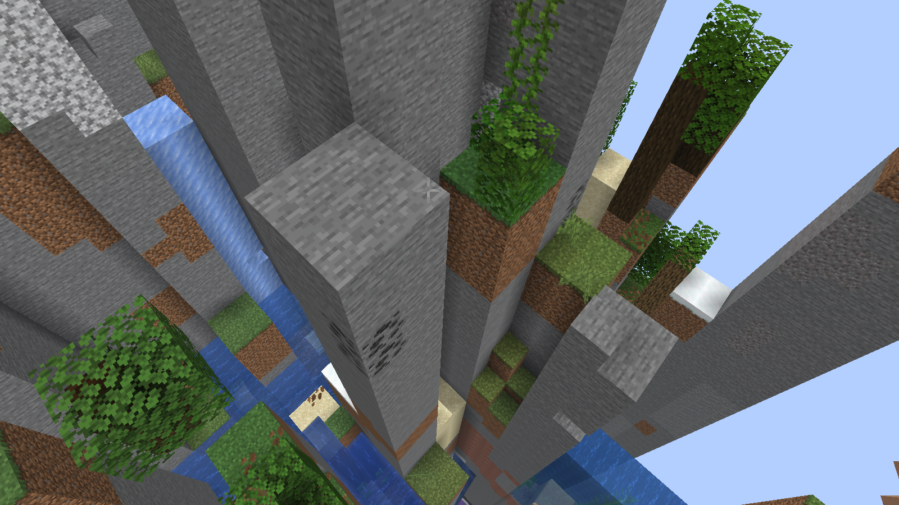
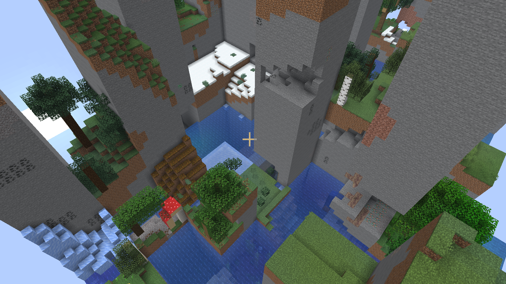
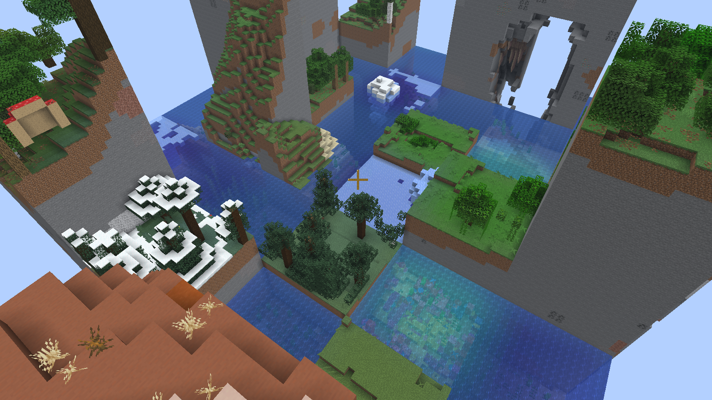
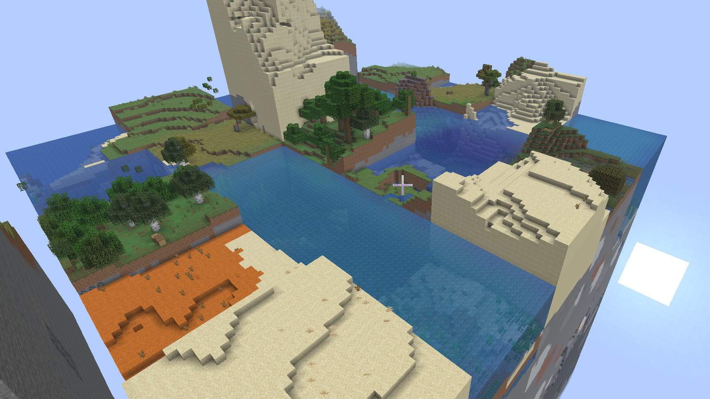
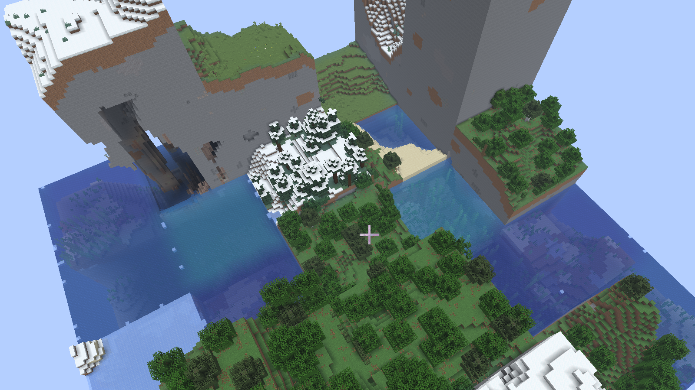

# ChunkWorldBuilder

Russian version: [README.ru.md](README.ru.md)

Try a new Minecraft experience: your world expands patch by patch as you explore.

`ChunkWorldBuilder` is a Paper plugin that builds a target world from rectangular patches copied from a donor world.

## What It Does

- Expands the world when players approach the edge.
- Uses configurable patch size (for example `8x8`, `16x16`, `24x24`, `32x32`).
- Copies terrain data from a donor world into the target world.
- Keeps generation queued and rate-limited for better performance.
- Supports optional WorldEdit copy engine for faster large patch operations.
- Can place a progression End portal trigger on advancement.
- Supports movement/teleport safety to avoid entering not-yet-generated patches.

## Why Play It

- Exploration feels dynamic: the map grows with player movement.
- Every run can feel different based on donor world and patch settings.
- Good for survival challenge, discovery gameplay, and custom progression servers.

## Requirements

- Paper `1.21.1`
- Java `21`

## Installation

1. Build the plugin:
   - `.\gradlew.bat clean build`
2. Put the jar from `build/libs/` into your server `plugins/` folder.
3. Start the server.
4. Edit `plugins/ChunkWorldBuilder/config.yml` if needed.
5. Restart the server.

## Configuration

Main config file:

- `src/main/resources/config.yml` (default values in source)

Important options:

- `generation.patch-width`
- `generation.patch-length`
- `generation.copy-engine` (`AUTO | BUKKIT | WORLDEDIT`)
- `generation.donor-range-min/max-x/z`
- `performance.max-blocks-per-tick`
- `boundary.enabled`
- `teleport-safety.enabled`

## Screenshots

### Patch size 2x2

### Patch size 8x8

### Patch size 16x16

### Patch size 24x24

### Patch size 32x32

## Notes

- Changing patch size on an existing world triggers patch-grid migration.
- Recreating the target world clears patch storage for that world automatically.

## Support

If ChunkWorldBuilder made you smile, you can support development:

- Buy me a coffee: https://boosty.to/rogualex
